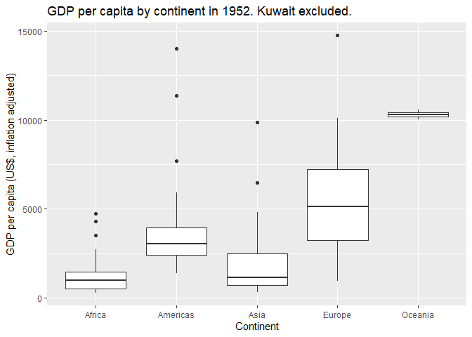
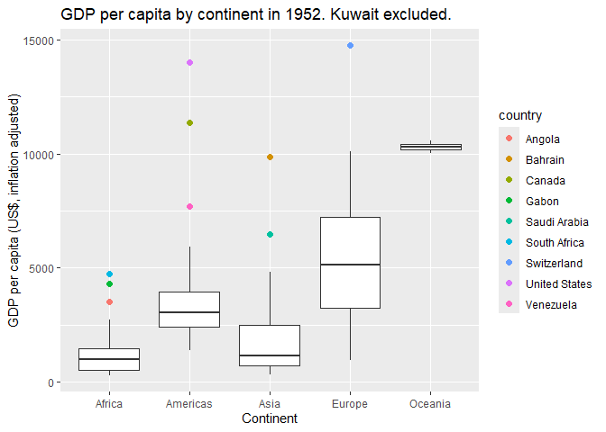
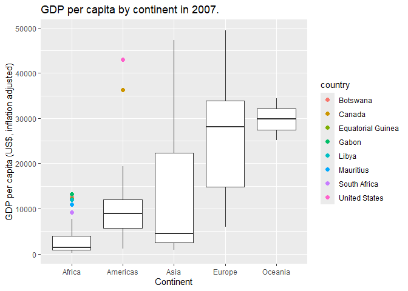
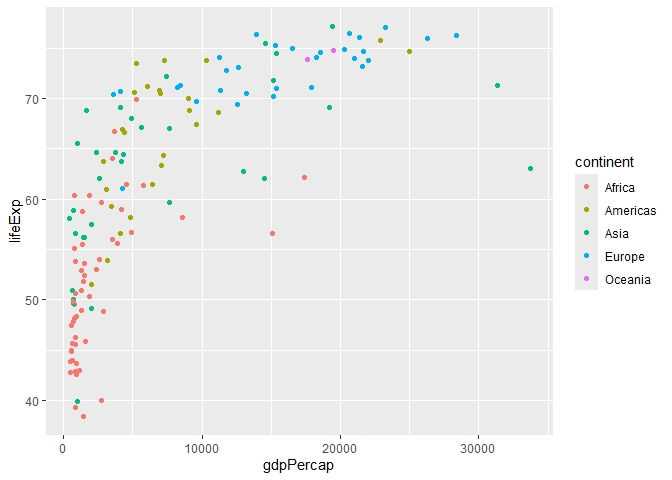

Gapminder
================
Luca Odio
2026-09-30

- [Grading Rubric](#grading-rubric)
  - [Individual](#individual)
  - [Submission](#submission)
- [Guided EDA](#guided-eda)
  - [**q0** Perform your “first checks” on the dataset. What variables
    are in
    this](#q0-perform-your-first-checks-on-the-dataset-what-variables-are-in-this)
  - [**q1** Determine the most and least recent years in the `gapminder`
    dataset.](#q1-determine-the-most-and-least-recent-years-in-the-gapminder-dataset)
  - [**q2** Filter on years matching `year_min`, and make a plot of the
    GDP per capita against continent. Choose an appropriate `geom_` to
    visualize the data. What observations can you
    make?](#q2-filter-on-years-matching-year_min-and-make-a-plot-of-the-gdp-per-capita-against-continent-choose-an-appropriate-geom_-to-visualize-the-data-what-observations-can-you-make)
  - [**q3** You should have found *at least* three outliers in q2 (but
    possibly many more!). Identify those outliers (figure out which
    countries they
    are).](#q3-you-should-have-found-at-least-three-outliers-in-q2-but-possibly-many-more-identify-those-outliers-figure-out-which-countries-they-are)
  - [**q4** Create a plot similar to yours from q2 studying both
    `year_min` and `year_max`. Find a way to highlight the outliers from
    q3 on your plot *in a way that lets you identify which country is
    which*. Compare the patterns between `year_min` and
    `year_max`.](#q4-create-a-plot-similar-to-yours-from-q2-studying-both-year_min-and-year_max-find-a-way-to-highlight-the-outliers-from-q3-on-your-plot-in-a-way-that-lets-you-identify-which-country-is-which-compare-the-patterns-between-year_min-and-year_max)
- [Your Own EDA](#your-own-eda)
  - [**q5** Create *at least* three new figures below. With each figure,
    try to pose new questions about the
    data.](#q5-create-at-least-three-new-figures-below-with-each-figure-try-to-pose-new-questions-about-the-data)

*Purpose*: Learning to do EDA well takes practice! In this challenge
you’ll further practice EDA by first completing a guided exploration,
then by conducting your own investigation. This challenge will also give
you a chance to use the wide variety of visual tools we’ve been
learning.

<!-- include-rubric -->

# Grading Rubric

<!-- -------------------------------------------------- -->

Unlike exercises, **challenges will be graded**. The following rubrics
define how you will be graded, both on an individual and team basis.

## Individual

<!-- ------------------------- -->

| Category | Needs Improvement | Satisfactory |
|----|----|----|
| Effort | Some task **q**’s left unattempted | All task **q**’s attempted |
| Observed | Did not document observations, or observations incorrect | Documented correct observations based on analysis |
| Supported | Some observations not clearly supported by analysis | All observations clearly supported by analysis (table, graph, etc.) |
| Assessed | Observations include claims not supported by the data, or reflect a level of certainty not warranted by the data | Observations are appropriately qualified by the quality & relevance of the data and (in)conclusiveness of the support |
| Specified | Uses the phrase “more data are necessary” without clarification | Any statement that “more data are necessary” specifies which *specific* data are needed to answer what *specific* question |
| Code Styled | Violations of the [style guide](https://style.tidyverse.org/) hinder readability | Code sufficiently close to the [style guide](https://style.tidyverse.org/) |

## Submission

<!-- ------------------------- -->

Make sure to commit both the challenge report (`report.md` file) and
supporting files (`report_files/` folder) when you are done! Then submit
a link to Canvas. **Your Challenge submission is not complete without
all files uploaded to GitHub.**

``` r
library(tidyverse)
```

    ## ── Attaching core tidyverse packages ──────────────────────── tidyverse 2.0.0 ──
    ## ✔ dplyr     1.2.1     ✔ readr     2.2.0
    ## ✔ forcats   1.0.1     ✔ stringr   1.6.0
    ## ✔ ggplot2   4.0.3     ✔ tibble    3.3.1
    ## ✔ lubridate 1.9.5     ✔ tidyr     1.3.2
    ## ✔ purrr     1.2.2     
    ## ── Conflicts ────────────────────────────────────────── tidyverse_conflicts() ──
    ## ✖ dplyr::filter() masks stats::filter()
    ## ✖ dplyr::lag()    masks stats::lag()
    ## ℹ Use the conflicted package (<http://conflicted.r-lib.org/>) to force all conflicts to become errors

``` r
library(gapminder)
```

*Background*: [Gapminder](https://www.gapminder.org/about-gapminder/) is
an independent organization that seeks to educate people about the state
of the world. They seek to counteract the worldview constructed by a
hype-driven media cycle, and promote a “fact-based worldview” by
focusing on data. The dataset we’ll study in this challenge is from
Gapminder.

# Guided EDA

<!-- -------------------------------------------------- -->

First, we’ll go through a round of *guided EDA*. Try to pay attention to
the high-level process we’re going through—after this guided round
you’ll be responsible for doing another cycle of EDA on your own!

### **q0** Perform your “first checks” on the dataset. What variables are in this

dataset?

``` r
## TASK: Do your "first checks" here!
?gapminder
```

    ## starting httpd help server ... done

``` r
head(gapminder)
```

    ## # A tibble: 6 × 6
    ##   country     continent  year lifeExp      pop gdpPercap
    ##   <fct>       <fct>     <int>   <dbl>    <int>     <dbl>
    ## 1 Afghanistan Asia       1952    28.8  8425333      779.
    ## 2 Afghanistan Asia       1957    30.3  9240934      821.
    ## 3 Afghanistan Asia       1962    32.0 10267083      853.
    ## 4 Afghanistan Asia       1967    34.0 11537966      836.
    ## 5 Afghanistan Asia       1972    36.1 13079460      740.
    ## 6 Afghanistan Asia       1977    38.4 14880372      786.

**Observations**:

- Variable names: country, continent, year, lifeExp, pop, gdpPercap./

### **q1** Determine the most and least recent years in the `gapminder` dataset.

*Hint*: Use the `pull()` function to get a vector out of a tibble.
(Rather than the `$` notation of base R.)

``` r
## TASK: Find the largest and smallest values of `year` in `gapminder`
year_max <- gapminder %>% pull(year) %>% max()
year_min <- gapminder %>% pull(year) %>% min()
```

Use the following test to check your work.

``` r
## NOTE: No need to change this
assertthat::assert_that(year_max %% 7 == 5)
```

    ## [1] TRUE

``` r
assertthat::assert_that(year_max %% 3 == 0)
```

    ## [1] TRUE

``` r
assertthat::assert_that(year_min %% 7 == 6)
```

    ## [1] TRUE

``` r
assertthat::assert_that(year_min %% 3 == 2)
```

    ## [1] TRUE

``` r
if (is_tibble(year_max)) {
  print("year_max is a tibble; try using `pull()` to get a vector")
  assertthat::assert_that(False)
}

print("Nice!")
```

    ## [1] "Nice!"

### **q2** Filter on years matching `year_min`, and make a plot of the GDP per capita against continent. Choose an appropriate `geom_` to visualize the data. What observations can you make?

You may encounter difficulties in visualizing these data; if so document
your challenges and attempt to produce the most informative visual you
can.

``` r
## TASK: Create a visual of gdpPercap vs continent
gapminder %>%
  filter(year == year_min & country != "Kuwait") %>%
  ggplot(aes(continent, gdpPercap)) +
  geom_boxplot() +
  labs(
    title = "GDP per capita by continent in 1952. Kuwait excluded.",
    x = "Continent",
    y = "GDP per capita (US$, inflation adjusted)"
  )
```

<!-- -->

**Observations**:

- Oceania has the most compact distribution of the continents, also with
  the highest median GDP per capita. This is likely because the number
  of countries contained in Oceania relatively small.
- Africa has the lowest median of the continents represented, also with
  a compact distribution. There are three outliers displayed, all below
  \$5000 GDP per capita. Notably, the medians for Europe and Oceania are
  greater than the highest GDP per capita in Africa.
- Asia has the second lowest median, close to Africa’s. The distribution
  is right skewed, indicating that a small number of higher values are
  pulling the distribution up.
- The Americas are combined, which is an interesting choice. I wonder if
  that’s because South America has only 12 countries.
- Europe has the largest interquartile range, indicating that European
  countries have a relatively higher variation in their GDP per capita
  than other continents.

**Difficulties & Approaches**:

- Tried a box plot to look at the GDP per capita distribution by
  continent. There is a really strong outlier in Asia which condenses
  the rest of the plot to such a degree that it’s unreadable.

- Upon investigation, the outlier is Kuwait, which had a GDP per capita
  of ~108,000 (US\$, inflation adjusted) in 1952.

- Removed Kuwait from the graph to improve overall legibility.

- Tried a scatterplot using color to denote the continent; not very
  legible.

- Tried a gdpPercap vs country bar plot where the color of the bar
  indicated the continent the country was from and the bars are sorted
  lowest to highest in groups of continents.

  It visualized the distribution by continent which was interesting to
  see, but ultimately crowded and difficult to read. More legible when
  Kuwait was removed from the plot. May have potential as a group of
  separate plots by continent, but that could make it harder to make
  visual comparisons on the y axis.

``` r
# gapminder %>%
#   filter(year == year_min, country != "Kuwait") %>%
#   arrange(continent, gdpPercap) %>%
#   mutate(country_fct = factor(country, levels = country)) %>%
#   ggplot(aes(x = country_fct, y = gdpPercap, fill = continent)) +
#   geom_col(position = "dodge")
```

### **q3** You should have found *at least* three outliers in q2 (but possibly many more!). Identify those outliers (figure out which countries they are).

``` r
## TASK: Identify the outliers from q2
gapminder %>%
  filter(year == year_min, continent == "Asia") %>%
  arrange(desc(gdpPercap))
```

    ## # A tibble: 33 × 6
    ##    country          continent  year lifeExp      pop gdpPercap
    ##    <fct>            <fct>     <int>   <dbl>    <int>     <dbl>
    ##  1 Kuwait           Asia       1952    55.6   160000   108382.
    ##  2 Bahrain          Asia       1952    50.9   120447     9867.
    ##  3 Saudi Arabia     Asia       1952    39.9  4005677     6460.
    ##  4 Lebanon          Asia       1952    55.9  1439529     4835.
    ##  5 Iraq             Asia       1952    45.3  5441766     4130.
    ##  6 Israel           Asia       1952    65.4  1620914     4087.
    ##  7 Japan            Asia       1952    63.0 86459025     3217.
    ##  8 Hong Kong, China Asia       1952    61.0  2125900     3054.
    ##  9 Iran             Asia       1952    44.9 17272000     3035.
    ## 10 Singapore        Asia       1952    60.4  1127000     2315.
    ## # ℹ 23 more rows

**Observations**:

- Identify the outlier countries from q2
  - Africa: South Africa, Gabon, Angola
  - Americas: United States, Canada, Venezuela
  - Asia: Kuwait, Bahrain, Saudi Arabia
  - Europe: Switzerland
  - Oceania: N/A

*Hint*: For the next task, it’s helpful to know a ggplot trick we’ll
learn in an upcoming exercise: You can use the `data` argument inside
any `geom_*` to modify the data that will be plotted *by that geom
only*. For instance, you can use this trick to filter a set of points to
label:

``` r
## NOTE: No need to edit, use ideas from this in q4 below
gapminder %>%
  filter(year == max(year)) %>%

  ggplot(aes(continent, lifeExp)) +
  geom_boxplot() +
  geom_point(
    data = . %>% filter(country %in% c("United Kingdom", "Japan", "Zambia")),
    mapping = aes(color = country),
    size = 2
  )
```

<!-- -->

### **q4** Create a plot similar to yours from q2 studying both `year_min` and `year_max`. Find a way to highlight the outliers from q3 on your plot *in a way that lets you identify which country is which*. Compare the patterns between `year_min` and `year_max`.

*Hint*: We’ve learned a lot of different ways to show multiple
variables; think about using different aesthetics or facets.

``` r
## TASK: Create a visual of gdpPercap vs continent
outliers_1952 <- c("South Africa", "Gabon", "Angola", "United States", "Canada",
              "Venezuela", "Kuwait", "Bahrain", "Saudi Arabia", "Switzerland")
```

``` r
gapminder %>%
  filter(year == year_min, country != "Kuwait") %>%
  ggplot(aes(continent, gdpPercap)) +
  geom_boxplot() +
  geom_point(
    data = . %>% filter(country %in% outliers_1952),
    mapping = aes(color = country),
    size = 2
  ) +
  labs(
    title = "GDP per capita by continent in 1952. Kuwait excluded.",
    x = "Continent",
    y = "GDP per capita (US$, inflation adjusted)"
  )
```

<!-- -->

``` r
# Identify 2007 outliers via boxplot and manual inspection
outliers_2007 <- c("Gabon", "Botswana", "Equatorial Guinea", "Libya", 
                   "Mauritius", "South Africa", "United States", "Canada")
gapminder %>%
  filter(year == max(year), continent == "Africa") %>%
  arrange(desc(gdpPercap))
```

    ## # A tibble: 52 × 6
    ##    country           continent  year lifeExp      pop gdpPercap
    ##    <fct>             <fct>     <int>   <dbl>    <int>     <dbl>
    ##  1 Gabon             Africa     2007    56.7  1454867    13206.
    ##  2 Botswana          Africa     2007    50.7  1639131    12570.
    ##  3 Equatorial Guinea Africa     2007    51.6   551201    12154.
    ##  4 Libya             Africa     2007    74.0  6036914    12057.
    ##  5 Mauritius         Africa     2007    72.8  1250882    10957.
    ##  6 South Africa      Africa     2007    49.3 43997828     9270.
    ##  7 Reunion           Africa     2007    76.4   798094     7670.
    ##  8 Tunisia           Africa     2007    73.9 10276158     7093.
    ##  9 Algeria           Africa     2007    72.3 33333216     6223.
    ## 10 Egypt             Africa     2007    71.3 80264543     5581.
    ## # ℹ 42 more rows

``` r
gapminder %>%
  filter(year == year_max) %>%
  ggplot(aes(continent, gdpPercap)) +
  geom_boxplot() +
  geom_point(
    data = . %>% filter(country %in% outliers_2007),
    mapping = aes(color = country),
    size = 2,
  ) +
  labs(
    title = "GDP per capita by continent in 2007.",
    x = "Continent",
    y = "GDP per capita (US$, inflation adjusted)"
  )
```

<!-- -->

**Observations**:

- There are fewer outliers in 2007 and the outliers that do exist are
  not as evenly distributed by continent. In 1952 there were 10 outliers
  across four continents, in 2007 there were 8 outliers across two
  continents – 6 of 8 (75%) in Africa, and the remaining 2 in the
  Americas.
- Africa still has the lowest median GDP per capita, again followed by
  Asia.
- Asia has a greatly increased IQR.
- Asia and Africa have pronounced right skews, indicating a cluster of
  lower GDP per capita countries in Q2 and a spread of higher GDP per
  capita countries in Q3. Asia specifically has a very long upper
  whisker (though Africa also has a long upper whisker relative to the
  lower whisker) suggesting a greater spread of values in the higher GDP
  per capita countries. Conversely, Europe is left skewed.
- Asia and Europe have the largest ranges by far when not including
  outliers. They are they have the second and third most countries by
  continent, respectively, behind Africa.
- The relative pattern between the median GDP per capitas of each
  continent is consistent from 1952 to 2007.
- The general magnitudes of GDP per capita have increased across the
  board, with a disproportionate increase in the median GDP per capita
  of Europe.

# Your Own EDA

<!-- -------------------------------------------------- -->

Now it’s your turn! We just went through guided EDA considering the GDP
per capita at two time points. You can continue looking at outliers,
consider different years, repeat the exercise with `lifeExp`, consider
the relationship between variables, or something else entirely.

### **q5** Create *at least* three new figures below. With each figure, try to pose new questions about the data.

``` r
## TASK: Your first graph
gapminder %>%
  filter(year == 1982) %>%
  ggplot(aes(gdpPercap, lifeExp, color = continent)) +
  geom_point()
```

<!-- -->

- Does life expectancy correlate to GDP per capita?
- For the 0-10000 US\$ GDP per capita range, there is a wide range of
  life expectancy, from late thirties to early seventies.

``` r
## TASK: Your second graph
```

- Does life expectancy correlate with the population of a country?

``` r
## TASK: Your third graph

gapminder %>%
  filter(year %in% c(year_min, year_max)) %>%
  group_by(country) %>%
  mutate(d_lifeExp = lifeExp[year = year_max] - lifeExp[year = year_min])
```

    ## # A tibble: 284 × 7
    ## # Groups:   country [142]
    ##    country     continent  year lifeExp      pop gdpPercap d_lifeExp
    ##    <fct>       <fct>     <int>   <dbl>    <int>     <dbl>     <dbl>
    ##  1 Afghanistan Asia       1952    28.8  8425333      779.        NA
    ##  2 Afghanistan Asia       2007    43.8 31889923      975.        NA
    ##  3 Albania     Europe     1952    55.2  1282697     1601.        NA
    ##  4 Albania     Europe     2007    76.4  3600523     5937.        NA
    ##  5 Algeria     Africa     1952    43.1  9279525     2449.        NA
    ##  6 Algeria     Africa     2007    72.3 33333216     6223.        NA
    ##  7 Angola      Africa     1952    30.0  4232095     3521.        NA
    ##  8 Angola      Africa     2007    42.7 12420476     4797.        NA
    ##  9 Argentina   Americas   1952    62.5 17876956     5911.        NA
    ## 10 Argentina   Americas   2007    75.3 40301927    12779.        NA
    ## # ℹ 274 more rows

- Has life expectancy been increasing by country?
